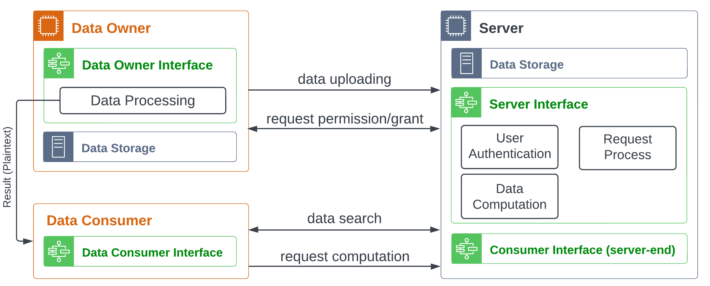
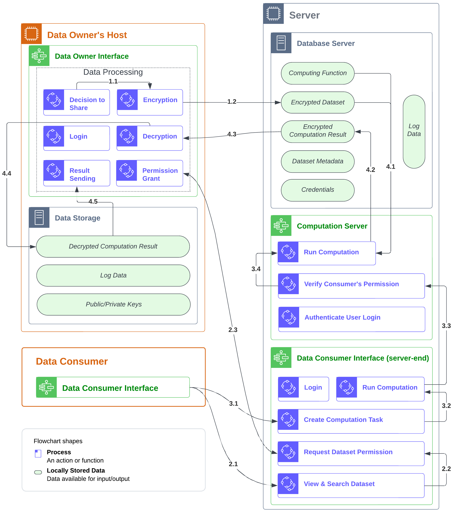
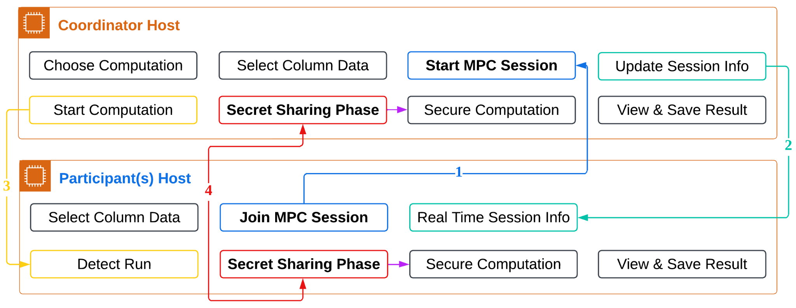

# FHE and MPC Based Privacy-Preserving Computation

This repository is the top-level entry point for a privacy-preserving
computation system built with two complementary approaches:

- **Fully Homomorphic Encryption (FHE)** for outsourced computation on encrypted
  datasets using a central server and a local data-owner application.
- **Multi-Party Computation (MPC)** for collaborative computation where multiple
  parties jointly compute results without revealing their raw inputs.

The implementation is split into two private submodule repositories:

- [`fhe/`](fhe): FHE compute system, including the FHE server and Data Owner app.
- [`mpc/`](mpc): MPC system, including the MP-SPDZ-backed web workflow.

## System Overview



The FHE workflow separates three roles: the Data Owner encrypts datasets and
keeps the client key locally, the Server stores ciphertext and runs TFHE
computations, and the Data Consumer searches datasets and requests computations.

## FHE Design



The FHE implementation is organized as:

- `fhe/server`: FHEDataServer, the central HTTPS server and Data Consumer UI.
- `fhe/data-owner`: DataOwnerWebApp, the local app used to encrypt datasets,
  manage local keys, upload encrypted data, and decrypt computation results.

The main FHE path uses **TFHE-rs**. OpenFHE/CKKS is only kept as a standalone
experimental script in the FHE server project.

## MPC Design



The MPC implementation coordinates a session between a Coordinator Host and one
or more Participant Hosts. Each party selects its own local input columns, then
the backend launches MP-SPDZ party processes to run secure computations.

Supported MPC computations include:

- Linear Regression
- Two-way ANOVA
- Three-way ANOVA

## FHE Design Rationale

The FHE implementation uses TFHE-rs rather than a CKKS-based stack because the
system needs exact integer behavior, comparisons, conditional logic, and
cross-dataset workflows.

| Feature | Edge-FHE (CKKS) | This Work (TFHE-rs) |
| --- | --- | --- |
| Arithmetic operations | Supported | Supported |
| Division | Approximate / rescale based | Exact integer workflow |
| Comparisons | Limited | Supported |
| Conditional logic | Limited | Supported |
| Approximation error | Yes | No integer approximation error |
| Public encryption key | Required | Not required for this workflow |
| Precomputation reuse | Limited | Supported |
| Cross-dataset computation | Limited | Supported for same data owner |
| Execution parallelization | Supported | Supported |

## Repository Layout

```text
fhe-mpc-privacy-preserving-computation/
  ├─ fhe/                 # submodule -> fhe-compute-system
  │  ├─ server/           # FHEDataServer
  │  └─ data-owner/       # DataOwnerWebApp
  ├─ mpc/                 # submodule -> multi-party-compute-system
  ├─ docs/images/
  ├─ .gitmodules
  └─ README.md
```

## Clone

Because this project uses private submodules, clone with submodules after
authenticating to GitHub:

```bash
git clone --recurse-submodules https://github.com/LCD-UCCS/fhe-mpc-privacy-preserving-computation.git
```

If the repository was cloned without submodules:

```bash
git submodule update --init --recursive
```

## Quick Start

### FHE Server

```bash
cd fhe/server
./scripts/setup.sh --migrate --build-frontend
cd backend
cargo run
```

Open:

```text
https://127.0.0.1:9082
```

### FHE Data Owner App

```bash
cd fhe/data-owner
./scripts/setup.sh --build-frontend
cd backend
cargo run
```

Open:

```text
http://127.0.0.1:9081
```

For local HTTPS, trust the FHE server CA generated at:

```text
fhe/server/backend/DBServer/openssl/FHELocalCA.pem
```

### MPC App

```bash
cd mpc
./scripts/setup.sh --build-frontend
cd backend
cargo run
```

Open:

```text
http://127.0.0.1:9092
```

MPC computation requires MP-SPDZ binaries such as `semi-party.x`; see
[`mpc/README.md`](mpc/README.md) for setup details.

## Implementation Repositories

- [`fhe/README.md`](fhe/README.md): overview of the combined FHE repo.
- [`fhe/server/README.md`](fhe/server/README.md): FHE server setup, database
  migration, TLS, JWT, upload limits, and security notes.
- [`fhe/data-owner/README.md`](fhe/data-owner/README.md): Data Owner app setup,
  local encryption/decryption workflow, and FHE server CA trust.
- [`mpc/README.md`](mpc/README.md): MPC setup, MP-SPDZ requirements, session
  workflow, and supported computations.

## Extending the System (developers)

New computations are added as **trusted developer extensions compiled into the system —
not arbitrary user-uploaded scripts executed from the web UI.** Adding a method requires
source changes and a rebuild (and a database migration on the FHE side); the web UIs only
offer methods a developer has already registered.

- FHE / TFHE path: [`fhe/server/docs/ADDING_COMPUTATIONS.md`](fhe/server/docs/ADDING_COMPUTATIONS.md)
- MPC path: [`mpc/docs/ADDING_MPC_COMPUTATIONS.md`](mpc/docs/ADDING_MPC_COMPUTATIONS.md)

## Security Notes

- Do not commit generated `.env` files, JWT keys, TLS private keys, encrypted
  runtime datasets, computation results, or FHE client keys.
- In the FHE system, `cks.bin` stays local to the Data Owner app. The server
  should only receive encrypted data, metadata, and `sks.bin`.
- The FHE server and DataOwner app use local development TLS. Chrome and the
  DataOwner backend must trust `FHELocalCA.pem` for local testing.
- MPC session token protection can be enabled for LAN or production-like
  demonstrations; see the MPC README.

## Paper And Demo Materials

This codebase accompanies the paper:

**A Software System for FHE- and MPC-based Privacy-Preserving Computation:
Design, Analysis, and Implementation**

Suggested project materials to add here:

- Paper PDF or publication link.
- Demo video links.
- Setup screenshots.
- Reproducible demo dataset snapshot.
